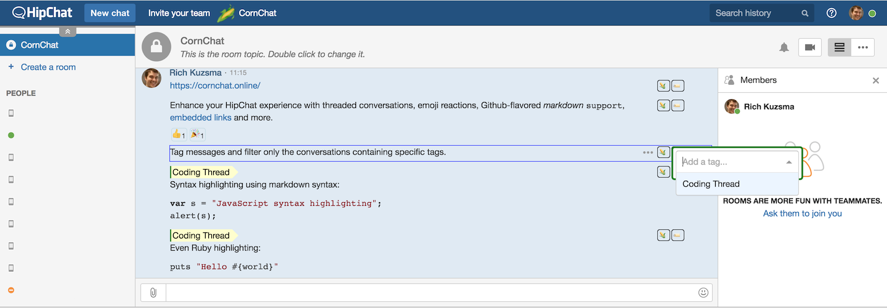
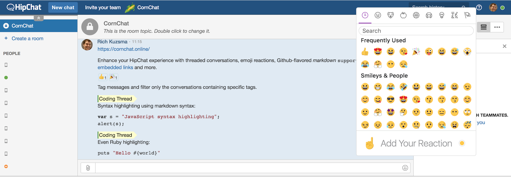

title: CornChat - HipChat's Missing Features
---

# CornChat

_Get the HipChat features you've always wanted._

Tag individual messages, and use Github-Flavored Markdown:




Filter message threads by tag:


React to individual messages with emoji:




## Getting Started

The Beta version of CornChat is now available.

### HipChat for Mac Installation

Open `/Applications/HipChat.app/Contents/Resources/chat.html` and add this line at the bottom:

```
<script src="https://builds.cornchat.online/ProdCornChat-bundle.js"></script>
```

Restart your HipChat client and you should see it running.


### HipChat Browser Installation

Login to your HipChat app and run this command to inject CornChat onto the page:

```javascript
var cornchat = document.createElement('script');
cornchat.setAttribute('src','https://builds.cornchat.online/ProdCornChat-bundle.js');
document.head.appendChild(cornchat);
```


### HipChat for Windows

_Coming soon!_


## How it Works

CornChat runs as a JavaScript bundle injected into your HipChat UI. A continuous [loop](https://github.com/rkuzsma/cornchat/blob/master/hipchat/src/msg-elements-store.js#L42) watches for new HipChat DOM elements, [decorates them with markdown](https://github.com/rkuzsma/cornchat/blob/master/hipchat/src/components/markdown-decorator.js) and injects a [custom toolbar](https://github.com/rkuzsma/cornchat/blob/master/hipchat/src/components/corn-cob.js).

When you tag a message, CornChat [posts](https://github.com/rkuzsma/cornchat/blob/master/hipchat/src/components/corn-cobs-container.js) the tag name and associated HipChat message UUID to a private [AWS AppSync](https://aws.amazon.com/appsync/)-managed [GraphQL instance](https://github.com/rkuzsma/cornchat/blob/master/webapp/cloudformation/templates/template.yaml#L244) using a [GraphQL mutation](https://github.com/rkuzsma/cornchat/blob/master/hipchat/src/mutations/addTag.js).

CornChat uses [MQTT over a WebSocket](https://docs.aws.amazon.com/appsync/latest/devguide/real-time-data.html) to [subscribe](https://github.com/rkuzsma/cornchat/blob/master/hipchat/src/components/msg-infos-container.js#L145) to AWS AppSync GraphQL [mutations made against tags and reactions](https://github.com/rkuzsma/cornchat/tree/master/hipchat/src/mutations). CornChat's [GraphQL schema](https://github.com/rkuzsma/cornchat/blob/master/webapp/cloudformation/graphql/schema.gql) uses AWS AppSync's `@aws_subscribe` directive to wire up the WebSockets on AppSync's managed GraphQL server. A [custom AWS lambda](https://github.com/rkuzsma/cornchat/blob/master/webapp/lambda/WritePublicConfig.js) publishes the GraphQL API URL to a [public configuration file on S3](https://s3.amazonaws.com/cornchat/public/TestCornChat/public-config/config.json) so that the CornChat [front-end Webpack build](https://github.com/rkuzsma/cornchat/blob/master/hipchat/webpack.common.js) can discover it.

CornChat's AppSync GraphQL server writes tags, reactions, and HipChat message UUID values to AWS DynamoDB using VTL [DynamoDB resolver templates](https://github.com/rkuzsma/cornchat/tree/master/webapp/cloudformation/graphql/resolvers).

To prevent abuse of the GraphQL server and database, CornChat JavaScript authenticates you by transmitting your [HipChat User ID and HipChat OAuth token](https://github.com/rkuzsma/cornchat/blob/master/hipchat/src/api-token.js#L11) to a [custom lambda](https://github.com/rkuzsma/cornchat/blob/master/webapp/lambda/GenerateToken.js) that [validates your OAuth token](https://github.com/rkuzsma/cornchat/blob/master/webapp/lambda/GenerateToken.js#L48) against the public HipChat server, `https://api.hipchat.com/`. Once authenticated, CornChat generates a CornChat API token, tied to your HipChat User ID, which can be used to login to CornChat itself. CornChat persists the CornChat API token in your [browser local storage](https://github.com/rkuzsma/cornchat/blob/master/hipchat/src/cornchat-user.js#L56). When CornChat starts up, it [invokes a login lambda](https://github.com/rkuzsma/cornchat/blob/master/hipchat/src/api-token.js#L41) to log you in with your API token. The [lambda generates temporary federated AWS Cognito credentials](https://github.com/rkuzsma/cornchat/blob/master/webapp/lambda/Login.js#L40) with [permissions](https://github.com/rkuzsma/cornchat/blob/master/webapp/cloudformation/templates/template.yaml#L169) to invoke CornChat GraphQL API endpoints.

CornChat does not store your HipChat OAuth token. It stores your HipChat UserID in a [DynamoDB table](https://github.com/rkuzsma/cornchat/blob/master/webapp/cloudformation/templates/template.yaml#L104) to associate the user with a CornChat API token, and in another [DynamoDB table](https://github.com/rkuzsma/cornchat/blob/master/webapp/cloudformation/templates/template.yaml#L89) to associate you with your reaction votes.

The CornChat UI makes heavy use of React where possible. It separates persistence functionality from UI functionality by using [container components and presentation components](https://medium.com/@dan_abramov/smart-and-dumb-components-7ca2f9a7c7d0). The [main app component](https://github.com/rkuzsma/cornchat/blob/master/hipchat/src/app.js) uses the [Render Props pattern](https://cdb.reacttraining.com/use-a-render-prop-50de598f11ce) to explicitly compose all the container and presentation components together.

## License

CornChat is [free](https://github.com/rkuzsma/cornchat/) and [open source](https://github.com/rkuzsma/cornchat) forever.

Reactions and tags are stored on our AWS server. No guarantees for uptime or data loss. You can always [host it yourself](https://github.com/rkuzsma/cornchat/) if the free, public, hosted version isn't sufficient.


##  Cure Cancer

Like CornChat? Hate Cancer? Please help my daughter Quinn and [donate 5 bucks to Alex’s Lemonade Stand](https://www.alexslemonade.org/mypage/1455792/donate/nojs). Don’t think too hard about it, just do it. It takes 2 minutes and the payment form is beautifully designed. You'll feel great doing it.
